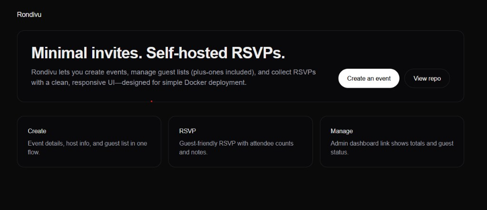
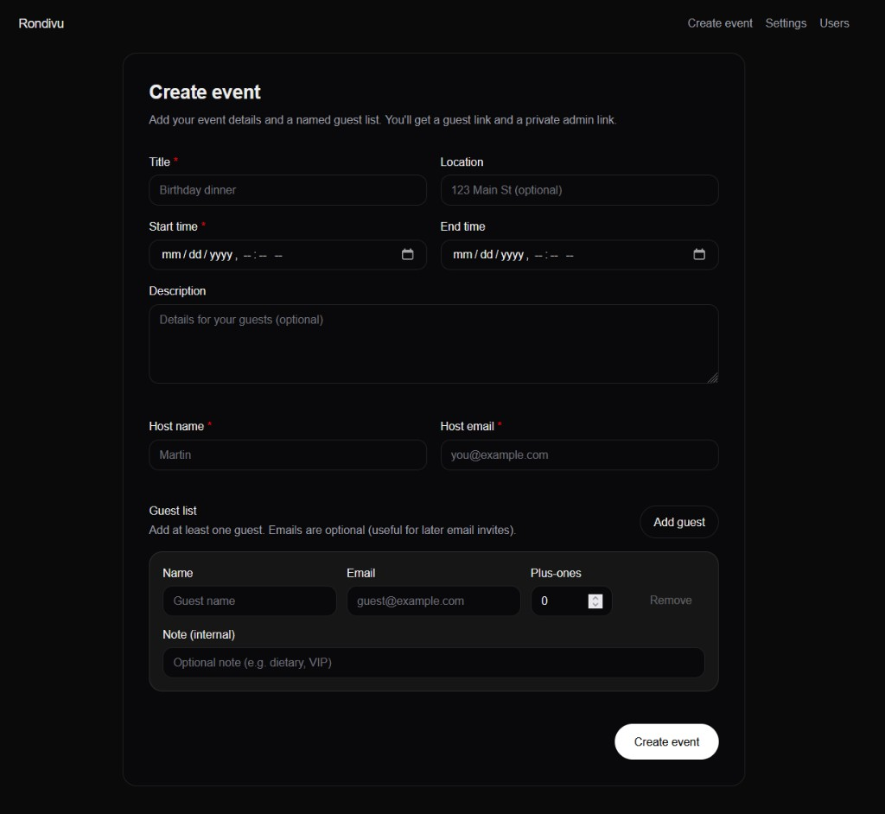
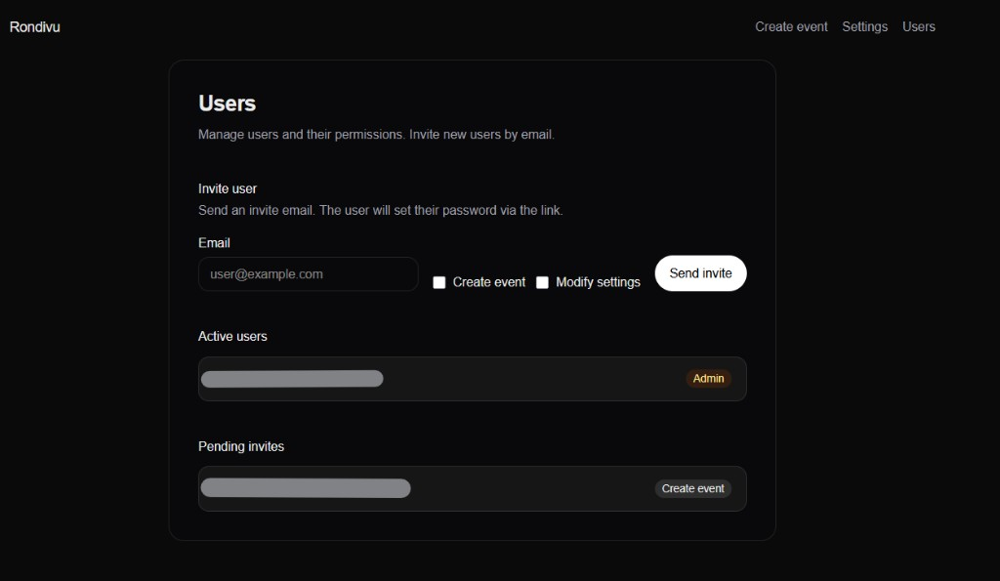
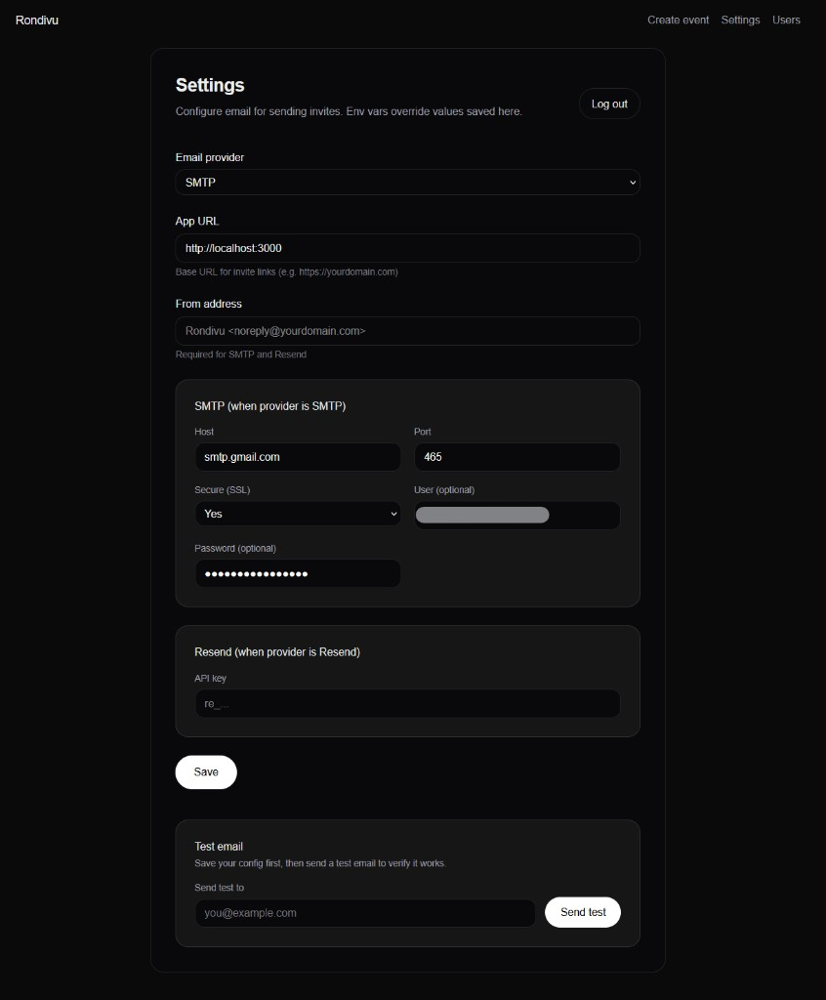

# Rondivu

Self-hosted, minimalist invite and RSVP kit for creating events, managing guest lists, and tracking responses.

**This app was built with AI assistance** (Cursor/Claude). Code structure, implementation, and security measures were developed iteratively with an AI coding assistant.

## Screenshots

| Home | Create event |
|------|--------------|
|  |  |

| Users | Settings |
|-------|----------|
|  |  |

## Tech stack

- **Next.js 16** (App Router), **React 19**, **TypeScript**
- **Prisma** + **SQLite** (PostgreSQL supported via config change)
- **TailwindCSS**, **Zod** (validation), **jose** (JWT), **bcryptjs**
- **Email**: Nodemailer (SMTP) or Resend

## Features

### Events & guests

- Create events with title, description, location, dates, host info
- Named guest lists with plus-ones, notes (per guest)
- Per-guest RSVP links (private; not exposed on the public event page)
- Public event page (`/e/[id]`) — event info only, no guest list
- RSVP page (`/e/[id]/g/[token]`) — Going / Maybe / Not going, plus-ones, note to host
- Admin dashboard (`/event/[id]/manage?key=...`) — counts, copy link, send invite by email

### Users & auth

- **First-run setup** (`/admin/setup`) — create first admin (email + password)
- **Migration** (`/admin/migrate`) — for existing installs with legacy password-only auth
- **User management** (`/users`) — invite users, assign permissions
- **Permissions**: Create Event, Modify Settings (admins have all)
- **Invite flow** — email invite with token; invitee sets password at `/accept-invite/[token]`

### Email

- SMTP, Resend, or copy-link-only (no email)
- Settings UI — configure provider, App URL, from address, SMTP/Resend in the browser
- Test email from Settings to verify config
- Env vars override DB-stored values if both are set

### Security

- bcrypt (cost 12), JWT sessions (HttpOnly, SameSite=Lax, Secure in prod)
- Open redirect prevention, input validation, security headers
- See [SECURITY.md](./SECURITY.md) for details and deployment guidance

## Routes

| Route | Description |
|-------|-------------|
| `/` | Home |
| `/create-event` | Create event (requires permission) |
| `/create-event/success` | Event created — guest & admin links |
| `/e/[publicId]` | Public event page (guests) |
| `/e/[publicId]/g/[token]` | RSVP page (per-guest link) |
| `/event/[publicId]/manage?key=...` | Admin dashboard |
| `/admin/setup` | First-run admin setup |
| `/admin/login` | Log in |
| `/admin/migrate` | Migrate legacy password to user account |
| `/accept-invite/[token]` | Accept user invite, set password |
| `/settings` | Email & app config (requires permission) |
| `/users` | User list & invite form (requires permission) |

## Local development

```bash
npm install
npx prisma generate
npx prisma migrate dev
npm run dev
```

Open `http://localhost:3000`. On first visit to Settings, Create event, or an event dashboard, you’ll be prompted to set up or log in.

## Docker

```bash
docker compose up --build
```

- App runs on port 3000
- Data persists in the `rondivu_data` volume
- DB path: `/data/dev.db`

## Configuration

### Environment variables

| Variable | Description |
|----------|-------------|
| `DATABASE_URL` | **Required**. SQLite: `file:./dev.db` (local) or `file:/data/dev.db` (Docker) |

Copy `.env.example` to `.env` and set `DATABASE_URL`.

### Optional (override Settings UI)

| Variable | Overrides |
|----------|-----------|
| `APP_URL` | Base URL for invite links (e.g. `https://rondivu.example.com`) |
| `EMAIL_PROVIDER` | `none`, `smtp`, or `resend` |
| `EMAIL_FROM` | Sender address (e.g. `Rondivu <noreply@yourdomain.com>`) |
| `SMTP_HOST`, `SMTP_PORT`, `SMTP_SECURE`, `SMTP_USER`, `SMTP_PASS` | SMTP settings |
| `RESEND_API_KEY` | Resend API key |

See `.env.example` for the full list. Settings UI values are stored in the database; env vars override them when set.

### Settings UI (recommended)

1. Run the app; go to `/admin/setup` if first run.
2. After login, open **Settings**.
3. Configure **App URL**, **Email provider** (none / SMTP / Resend), **From address**, and provider-specific fields.
4. Use **Test email** to send a sample and confirm delivery.

## Production

- Use HTTPS (reverse proxy: Nginx, Caddy, etc.)
- Set `NODE_ENV=production`
- For higher traffic, consider PostgreSQL (change `provider` in `prisma/schema.prisma` and `DATABASE_URL` accordingly)
- See [SECURITY.md](./SECURITY.md) for deployment checklist
